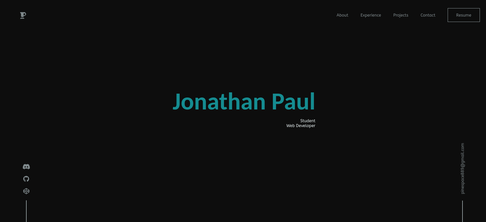

<h1 align="center">pinetheapple_2</h1>


---
## Using this repository
Fork and clone the repository.
### Set Up

1. Install Node.js
```sh
nvm install
```

2. Install Gatsby CLI- ([documentation](https://www.gatsbyjs.com/docs/))
```sh
npm install -g gatsby-cli
```

3. Install dependencies
```sh
npm install
```

### Running the server

- Starting a development server to see changes you make as you make them
```sh
gatsby develop
```

- Building the project
```sh
gatsby build
```

- Serve the built project
```sh
gatsby serve
```

